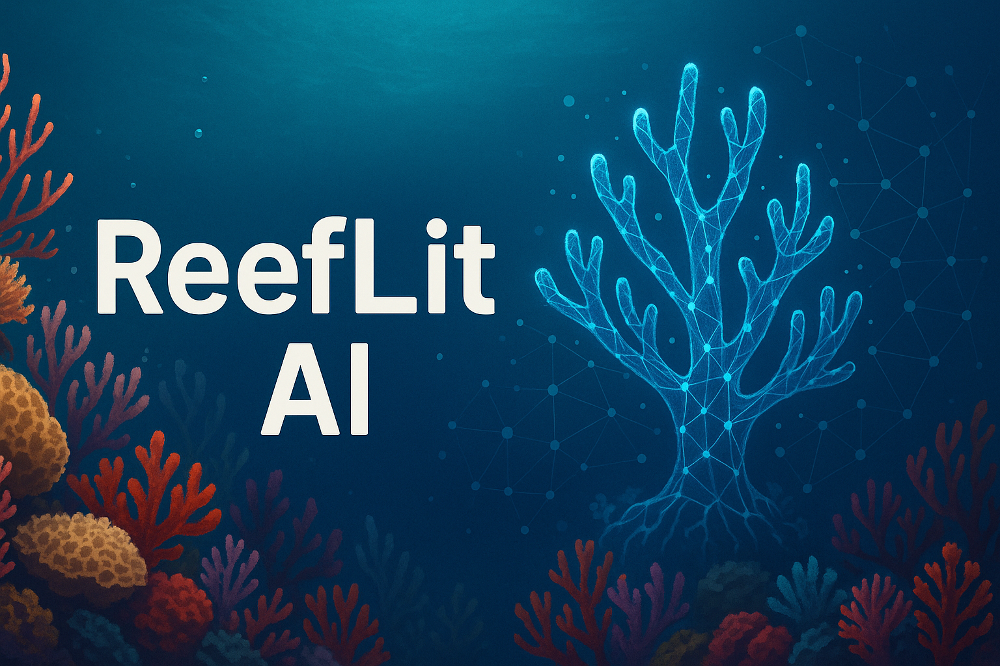

# ReefLit AI

*A living, automated meta‑analysis of global coral‑reef science*



> **Mission**  Read every new coral‑reef paper so managers, scientists, and the public can focus on saving reefs—not sifting literature.

---

## ✨ Key Features _(v1 MVP)_

| Stage | What It Does | Tech |
|-------|--------------|------|
| **Ingest** | Nightly harvests new titles/abstracts from CrossRef, PubMed, bioRxiv, NOAA CoRIS & *Coral Reefs* RSS | `Python`, `requests`, `GitHub Actions` |
| **Weak‑Label** | Tags each paper with stressor(s) using rule‑based taxonomy (warming, acidification, nutrients, etc.) | `spaCy`, `yaml` taxonomy |
| **Embed & Index** | Generates sentence embeddings and stores in vector DB for similarity search | `sentence‑transformers`, `FAISS` |
| **Dash UI** | Interactive web app: bar charts of stressors, keyword search, and PDF links | `Plotly Dash`, `Bootstrap` |
| **CI/CD** | Entire pipeline containerized & redeployed nightly | `Docker`, `GitHub Actions`, `Render` (free tier) |

---

## 🖼️ Screenshot

*(placeholder)*

---

## 🚀 Quick Start

```bash
# Clone
$ git clone https://github.com/lindyrock/ReefLit‑AI.git
$ cd ReefLit‑AI

# Create env (conda or venv)
$ conda env create ‑f environment.yml && conda activate reeflit

# Run pipeline locally
$ python pipeline/fetch_and_label.py
$ python pipeline/build_index.py

# Launch dashboard
$ python app/app.py
```

_or spin up the whole stack in Docker_

```bash
$ docker compose up --build
```

The dashboard appears at **http://localhost:8050**.

---

## 🗄️ Project Structure

```
ReefLit‑AI/
├── app/                # Dash interface
├── pipelines/          # Ingest, label, embed scripts
├── config/             # Taxonomy and configuration files
├── data/               # JSONL corpora, FAISS index (git‑ignored)
├── docs/               # Additional docs / images
├── src/                # lib code (models, utils)
├── tests/              # pytest suite
├── Dockerfile
└── environment.yml             # Conda environment
```

---

## 📈 Road‑Map

1. **PDF Parsing & NER** – extract effect sizes, locations, species.
2. **RAG Q&A API** – “Ask ReefLit” natural‑language endpoint.
3. **Knowledge Graph** – Neo4j of reef × stressor × intervention links.
4. **PRISMA‑style living review** – auto‑generated HTML + Zenodo DOI.

Full roadmap lives in [`PROJECTS`](https://github.com/your‑handle/ReefLit‑AI/projects).

---

## 🤝 Contributing

* Open an issue to discuss ideas or bugs.
* Small pull requests welcome — see `CONTRIBUTING.md`.

All contributors must follow our [Code of Conduct](CODE_OF_CONDUCT.md).

---

## 📜 License

Released under the **MIT License**. See `LICENSE` for details.

---

## 📣 Cite Us

```text
@misc{ReefLitAI2025,
  title  = {ReefLit AI: A Living Meta‑Analysis of Coral‑Reef Literature},
  author = {Rauchenstein, Lynn},
  year   = 2025,
  howpublished = {\url{https://reeflit.ai}}
}
```

---

## 🙏 Acknowledgements

Built with 😍 for coral reefs. Inspired by NOAA Coral Reef Watch, ARC CoE Coral Reefs, Earth Species Project, and countless open‑source developers.

---

## 📬 Contact

*Project lead*: **Lindy Rauchenstein**   |   `lrauchenstein@gmail.com`   |   [@lindyrock](https://twitter.com/lindyrock)

Follow the project: **@ReefLit_AI** on Twitter/X.

